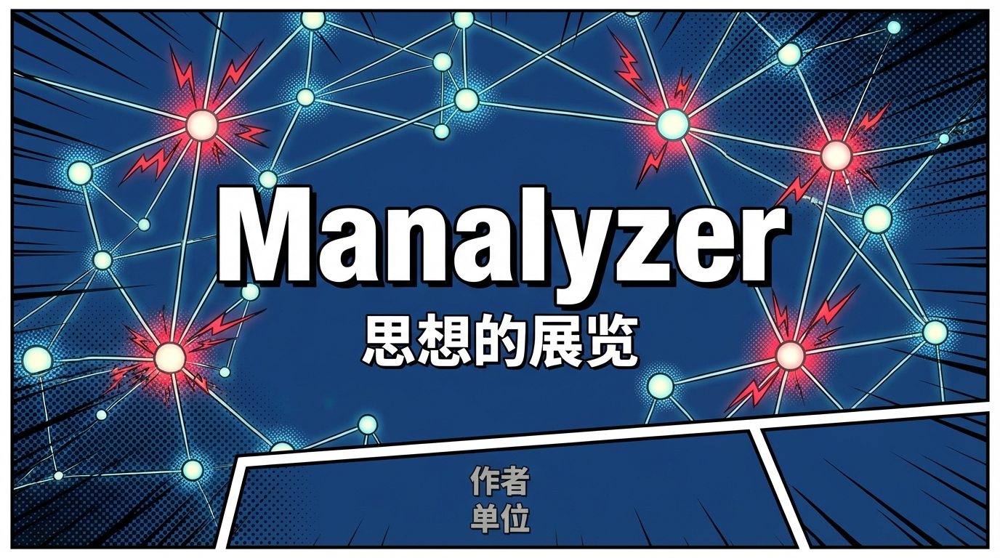
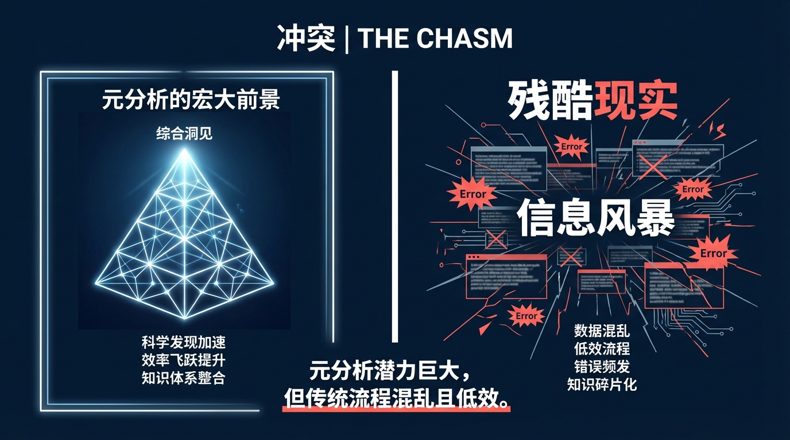
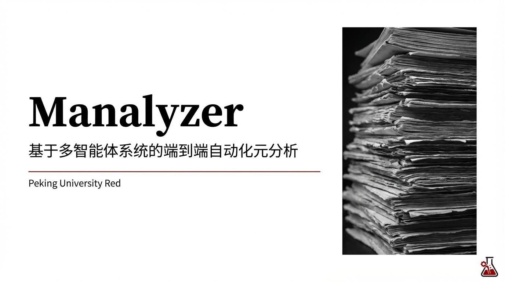
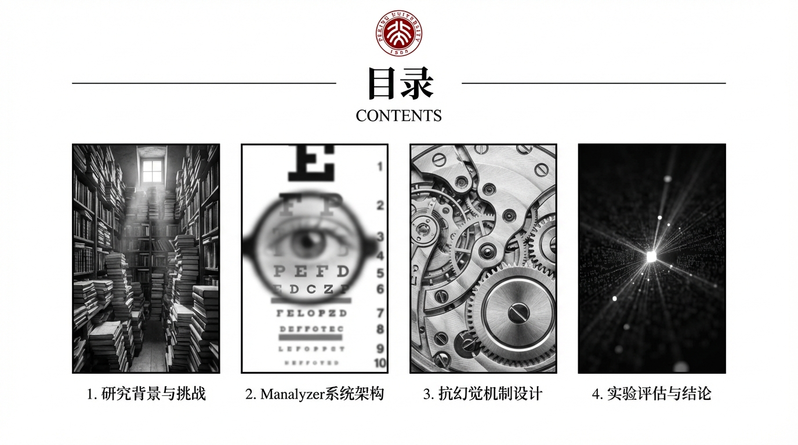
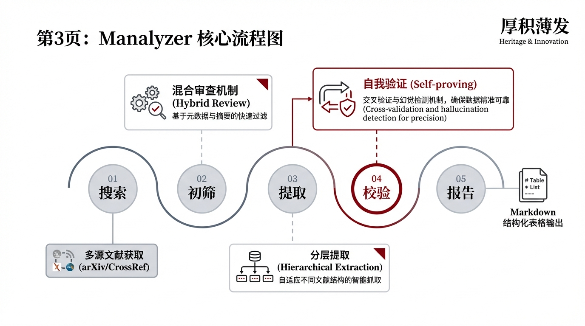
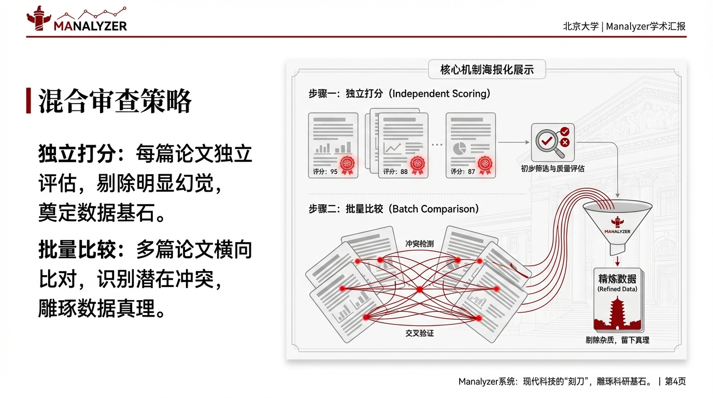
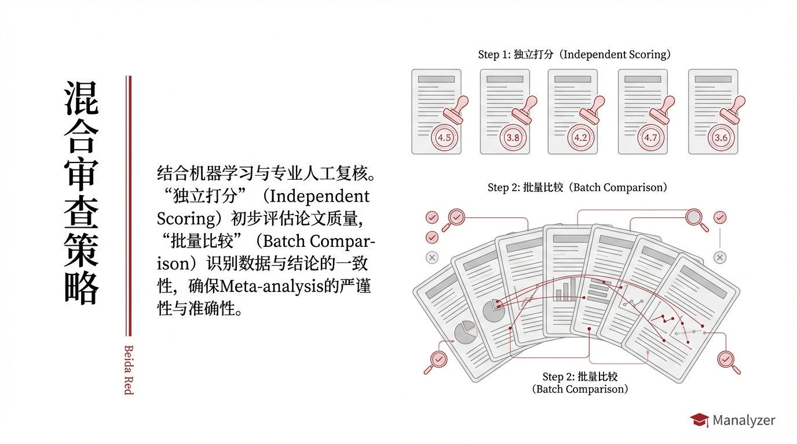
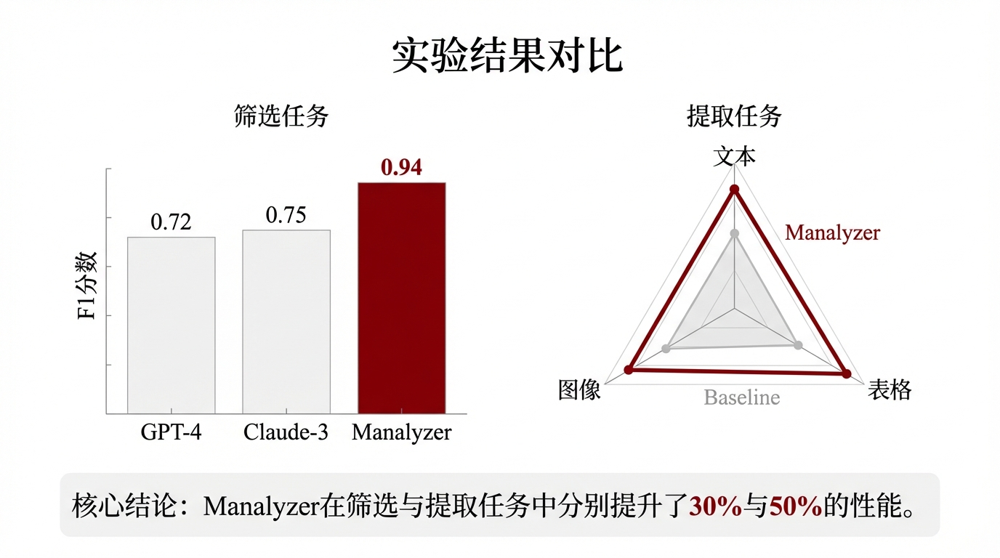

## 2025-12-07 13:23:59 CST

- **Prompt**: ### **《Manalyzer: 思想的展览》学术汇报PPT设计企划书**

**1. 企划概要**

- **主题：** 将《Manalyzer》论文的核心思想，通过一套具有高度视觉一致性和艺术美感的设计语言，进行一次沉浸式、富有说服力的学术呈现。
- **设计哲学：** **“Clarity is Beauty.” (清晰即美)**。摒弃一切不必要的装饰，通过版式、色彩、排版和数据可视化，让信息自己说话，并赋予其力量感和优雅感。
- 
    - **风格灵感：** 融合瑞士国际主义版式设计（Swiss International Style）、高端科技产品发布会（如Apple）、以及《连线》(WIRED)杂志的信息图表风格。
- **目标听众：** 具有高审美水准的学术同行，他们不仅期待严谨的内容，更能欣赏优雅的表达方式。

**2. 核心设计系统 (Design System)**

- **色彩方案：**
    - **主色：** 深邃科技蓝 (#0A192F) 作为背景，营造沉静、专业的氛围。
    - **强调色：** 活力珊瑚红 (#FF6B6B) 用于高亮关键数据、创新点和Manalyzer的标识。
    - **辅助色：** 中性灰 (#8892B0) 用于正文和次要信息。亮白 (#FFFFFF) 用于标题和图表元素。
- **字体系统：**
    - **标题：** 使用一款现代、无衬线的粗体字（如Helvetica Now Display Bold或Inter Bold），字号要大，形成视觉焦点。
    - **正文：** 使用同一字体家族的常规体，保证极致的可读性。
- **视觉语言：**
    - **图标：** 设计一套专属的、线条简洁的图标系统，代表“智能体”、“数据”、“验证”等核心概念。
    - **动效：** 动画效果极简且有意义。只用于引导视线、展示流程或突出数据变化，杜绝无意义的飞入飞出。

**3. 分页设计蓝图 (The Exhibition Layout)**

### **Slide 1: 序幕 | The Anchor**

- **主题：** 奠定基调，如电影海报般引人入胜。
- **设计理念：** 视觉悬念。用一个抽象但宏大的视觉元素抓住观众。
- **画面构图与视觉元素：**
    - **背景：** 深蓝色背景上，有一张由无数微光节点连接成的复杂网络图，部分节点因“过载”而闪烁着微弱的红色（暗示问题）。
    - **中央：** 论文标题《Manalyzer》使用巨大的白色粗体字占据视觉中心，如烙印般深刻。
    - **下方：** 作者和单位信息使用小号灰色字体，不抢风头。
- **核心内容：** 标题、作者、单位。但通过设计，它传递出“我们正在处理一个复杂而重要的问题”的信号。

请基于以上讨论，生成第【1】张漫画图片，尺寸 4:3，中文
- **参考图片**: (无)
- **模型文本**: (无)
- **返回图片数量**: 2

**保存的图片：**

## 2025-12-07 13:26:05 CST

- **Prompt**: ### **《Manalyzer: 思想的展览》学术汇报PPT设计企划书**

**1. 企划概要**

- **主题：** 将《Manalyzer》论文的核心思想，通过一套具有高度视觉一致性和艺术美感的设计语言，进行一次沉浸式、富有说服力的学术呈现。
- **设计哲学：** **“Clarity is Beauty.” (清晰即美)**。摒弃一切不必要的装饰，通过版式、色彩、排版和数据可视化，让信息自己说话，并赋予其力量感和优雅感。
- 
    - **风格灵感：** 融合瑞士国际主义版式设计（Swiss International Style）、高端科技产品发布会（如Apple）、以及《连线》(WIRED)杂志的信息图表风格。
- **目标听众：** 具有高审美水准的学术同行，他们不仅期待严谨的内容，更能欣赏优雅的表达方式。

**2. 核心设计系统 (Design System)**

- **色彩方案：**
    - **主色：** 深邃科技蓝 (#0A192F) 作为背景，营造沉静、专业的氛围。
    - **强调色：** 活力珊瑚红 (#FF6B6B) 用于高亮关键数据、创新点和Manalyzer的标识。
    - **辅助色：** 中性灰 (#8892B0) 用于正文和次要信息。亮白 (#FFFFFF) 用于标题和图表元素。
- **字体系统：**
    - **标题：** 使用一款现代、无衬线的粗体字（如Helvetica Now Display Bold或Inter Bold），字号要大，形成视觉焦点。
    - **正文：** 使用同一字体家族的常规体，保证极致的可读性。
- **视觉语言：**
    - **图标：** 设计一套专属的、线条简洁的图标系统，代表“智能体”、“数据”、“验证”等核心概念。
    - **动效：** 动画效果极简且有意义。只用于引导视线、展示流程或突出数据变化，杜绝无意义的飞入飞出。

**3. 分页设计蓝图 (The Exhibition Layout)**

### **Slide 1: 序幕 | The Anchor**

- **主题：** 奠定基调，如电影海报般引人入胜。
- **设计理念：** 视觉悬念。用一个抽象但宏大的视觉元素抓住观众。
- **画面构图与视觉元素：**
    - **背景：** 深蓝色背景上，有一张由无数微光节点连接成的复杂网络图，部分节点因“过载”而闪烁着微弱的红色（暗示问题）。
    - **中央：** 论文标题《Manalyzer》使用巨大的白色粗体字占据视觉中心，如烙印般深刻。
    - **下方：** 作者和单位信息使用小号灰色字体，不抢风头。
- **核心内容：** 标题、作者、单位。但通过设计，它传递出“我们正在处理一个复杂而重要的问题”的信号。

请基于以上讨论，生成第【1】张漫画图片，尺寸 16:9，简体中文
- **参考图片**: (无)
- **模型文本**: (无)
- **返回图片数量**: 2

**保存的图片：**

## 2025-12-07 13:28:13 CST

- **Prompt**: ### **《Manalyzer: 思想的展览》学术汇报PPT设计企划书**

**1. 企划概要**

- **主题：** 将《Manalyzer》论文的核心思想，通过一套具有高度视觉一致性和艺术美感的设计语言，进行一次沉浸式、富有说服力的学术呈现。
- **设计哲学：** **“Clarity is Beauty.” (清晰即美)**。摒弃一切不必要的装饰，通过版式、色彩、排版和数据可视化，让信息自己说话，并赋予其力量感和优雅感。
- 
    - **风格灵感：** 融合瑞士国际主义版式设计（Swiss International Style）、高端科技产品发布会（如Apple）、以及《连线》(WIRED)杂志的信息图表风格。
- **目标听众：** 具有高审美水准的学术同行，他们不仅期待严谨的内容，更能欣赏优雅的表达方式。

**2. 核心设计系统 (Design System)**

- **色彩方案：**
    - **主色：** 深邃科技蓝 (#0A192F) 作为背景，营造沉静、专业的氛围。
    - **强调色：** 活力珊瑚红 (#FF6B6B) 用于高亮关键数据、创新点和Manalyzer的标识。
    - **辅助色：** 中性灰 (#8892B0) 用于正文和次要信息。亮白 (#FFFFFF) 用于标题和图表元素。
- **字体系统：**
    - **标题：** 使用一款现代、无衬线的粗体字（如Helvetica Now Display Bold或Inter Bold），字号要大，形成视觉焦点。
    - **正文：** 使用同一字体家族的常规体，保证极致的可读性。
- **视觉语言：**
    - **图标：** 设计一套专属的、线条简洁的图标系统，代表“智能体”、“数据”、“验证”等核心概念。
    - **动效：** 动画效果极简且有意义。只用于引导视线、展示流程或突出数据变化，杜绝无意义的飞入飞出。

**3. 分页设计蓝图 (The Exhibition Layout)**

### **Slide 2: 冲突 | The Chasm**

- **主题：** 描绘元分析的宏大前景与残酷现实之间的鸿沟。
- **设计理念：** 强烈的视觉对立。
- **画面构图与视觉元素：**
    - **左侧 (The Promise):** 占据1/3版面。用明亮的线条勾勒出一个完美的、有序的知识金字塔，顶端散发着光芒，象征“综合洞见”。
    - **右侧 (The Peril):** 占据2/3版面。用混乱、断裂、相互重叠的线条和模糊的文本框模拟“信息风暴”，其中点缀着几个刺眼的红色“Error”符号。
    - **中间：** 一条清晰的垂直分割线，强调两者间的巨大鸿沟。
- **核心内容：** “元分析潜力巨大，但传统流程混乱且低效。”

### 请基于以上讨论，生成第【1】张漫画图片，尺寸 16:9，简体中文
- **参考图片**: (无)
- **模型文本**: (无)
- **返回图片数量**: 1

**保存的图片：**

## 2025-12-07 13:32:46 CST

- **Prompt**: ### **《Manalyzer》学术汇报PPT设计企划书（北大典雅学术版）**

**1. 设计理念：厚积薄发 (Heritage & Innovation)**

- **核心隐喻：** **“雕琢”**。参考图片中的石狮、华表、博雅塔代表着科研的基石与传统（Meta-analysis的严谨性）；而Manalyzer系统则是现代科技的“刻刀”，剔除杂质（幻觉），留下真理（数据）。
- **视觉基调：** **白底黑字，红韵点睛**。
    - **极简主义：** 大量的留白（Negative Space），强调呼吸感，让复杂的算法流程显得井井有条。
    - **人文质感：** 使用高精度的黑白摄影图片作为视觉锚点，搭配衬线体汉字，传递出学术的厚重感。

**2. 视觉识别系统 (VIS)**

- **配色方案 (参考图片)：**
    - **背景色：** 纯白 (#FFFFFF) 或 极浅灰 (#F5F5F5)。
    - **主文字：** 炭黑 (#333333) 用于正文，纯黑 (#000000) 用于标题。
    - **品牌色/强调色：** **北大红 (#8B0012)**。用于Logo、分割线、小标题装饰、图表中的重点数据（Manalyzer的表现）。
    - **辅助色：** **高级灰 (#708090)**。用于流程图的线条、底纹、次要数据。
- **字体选择：**
    - **中文标题：** **方正小标宋**或**思源宋体**（参考图片中的“目录”二字，宋体透出庄重与书卷气）。
    - **中文正文：** **思源黑体**（保证投影时的清晰可读性）。
    - **英文/数字：** **Times New Roman**（经典学术衬线体，与宋体搭配）或 **Arial**（用于图表标签）。

**3. 分页设计蓝图 (The Academic Scroll)**

---

### **封面页：静水流深**

- **画面构图：**
    - **背景：** 纯白底色。
    - **视觉中心：** 页面右侧放置一张**竖构图的黑白摄影**（参考图1的小图风格），内容可以是层叠的纸质文献或显微镜下的微观世界，处理成高对比度黑白，暗示“科研的海洋”。
    - **标题：** 左侧居中。主标题“Manalyzer”使用黑色粗宋体，字号极大。副标题“基于多智能体系统的端到端自动化元分析”使用较细的黑体。
    - **装饰：** 标题下方有一条细长的**北大红**横线，贯穿半个版面，右下角是校徽/实验室Logo。
- **设计意图：** 不用花哨的科技蓝光，用极简的红黑白传达“这是严肃的科学研究”。

请基于以上讨论，生成第【1】张漫画图片，尺寸 16:9，简体中文
- **参考图片**: (无)
- **模型文本**: (无)
- **返回图片数量**: 1

**保存的图片：**

## 2025-12-07 13:34:53 CST

- **Prompt**: ### **《Manalyzer》学术汇报PPT设计企划书（北大典雅学术版）**

**1. 设计理念：厚积薄发 (Heritage & Innovation)**

- **核心隐喻：** **“雕琢”**。参考图片中的石狮、华表、博雅塔代表着科研的基石与传统（Meta-analysis的严谨性）；而Manalyzer系统则是现代科技的“刻刀”，剔除杂质（幻觉），留下真理（数据）。
- **视觉基调：** **白底黑字，红韵点睛**。
    - **极简主义：** 大量的留白（Negative Space），强调呼吸感，让复杂的算法流程显得井井有条。
    - **人文质感：** 使用高精度的黑白摄影图片作为视觉锚点，搭配衬线体汉字，传递出学术的厚重感。

**2. 视觉识别系统 (VIS)**

- **配色方案 (参考图片)：**
    - **背景色：** 纯白 (#FFFFFF) 或 极浅灰 (#F5F5F5)。
    - **主文字：** 炭黑 (#333333) 用于正文，纯黑 (#000000) 用于标题。
    - **品牌色/强调色：** **北大红 (#8B0012)**。用于Logo、分割线、小标题装饰、图表中的重点数据（Manalyzer的表现）。
    - **辅助色：** **高级灰 (#708090)**。用于流程图的线条、底纹、次要数据。
- **字体选择：**
    - **中文标题：** **方正小标宋**或**思源宋体**（参考图片中的“目录”二字，宋体透出庄重与书卷气）。
    - **中文正文：** **思源黑体**（保证投影时的清晰可读性）。
    - **英文/数字：** **Times New Roman**（经典学术衬线体，与宋体搭配）或 **Arial**（用于图表标签）。

**3. 分页设计蓝图 (The Academic Scroll)**

---

### 

### **第1页：目录 (参考图片1)**

- **画面构图：** 严格复刻参考图1的经典布局。
- **顶部：** 红色校徽居中，下方是宋体大字“**目录**”及英文“CONTENTS”。两条细黑线夹住Logo。
- **中部：** 四张竖长方形图片并排。
    - **图片内容替换：** 将参考图中的古建筑替换为与论文相关的**黑白概念摄影**：
        1. **第一张（背景）：** 一座堆积如山的书库（象征海量文献）。
        2. **第二张（问题）：** 一张模糊失焦的视力表（象征LLM的幻觉）。
        3. **第三张（方法）：** 精密的机械齿轮咬合（象征多智能体协作）。
        4. **第四张（结果）：** 一束光照亮黑暗中的数据点（象征真理被发现）。
    - **文字：** 图片下方对应文字：
        1. 研究背景与挑战
        2. Manalyzer系统架构
        3. 抗幻觉机制设计
        4. 实验评估与结论
- **设计意图：** 用图像叙事，将四个枯燥的章节转化为四个视觉意象。
- 请基于以上讨论，生成第【1】张漫画图片，尺寸 16:9，简体中文
- **参考图片**: (无)
- **模型文本**: (无)
- **返回图片数量**: 1

**保存的图片：**

## 2025-12-07 13:35:55 CST

- **Prompt**: ### **《Manalyzer》学术汇报PPT设计企划书（北大典雅学术版）**

**1. 设计理念：厚积薄发 (Heritage & Innovation)**

- **核心隐喻：** **“雕琢”**。参考图片中的石狮、华表、博雅塔代表着科研的基石与传统（Meta-analysis的严谨性）；而Manalyzer系统则是现代科技的“刻刀”，剔除杂质（幻觉），留下真理（数据）。
- **视觉基调：** **白底黑字，红韵点睛**。
    - **极简主义：** 大量的留白（Negative Space），强调呼吸感，让复杂的算法流程显得井井有条。
    - **人文质感：** 使用高精度的黑白摄影图片作为视觉锚点，搭配衬线体汉字，传递出学术的厚重感。

**2. 视觉识别系统 (VIS)**

- **配色方案 (参考图片)：**
    - **背景色：** 纯白 (#FFFFFF) 或 极浅灰 (#F5F5F5)。
    - **主文字：** 炭黑 (#333333) 用于正文，纯黑 (#000000) 用于标题。
    - **品牌色/强调色：** **北大红 (#8B0012)**。用于Logo、分割线、小标题装饰、图表中的重点数据（Manalyzer的表现）。
    - **辅助色：** **高级灰 (#708090)**。用于流程图的线条、底纹、次要数据。
- **字体选择：**
    - **中文标题：** **方正小标宋**或**思源宋体**（参考图片中的“目录”二字，宋体透出庄重与书卷气）。
    - **中文正文：** **思源黑体**（保证投影时的清晰可读性）。
    - **英文/数字：** **Times New Roman**（经典学术衬线体，与宋体搭配）或 **Arial**（用于图表标签）。

**3. 分页设计蓝图 (The Academic Scroll)**

---

### 

### **第2页：过渡页 (参考图片2)**

- **画面构图：** 复刻参考图2的**全屏影像风格**。
- **背景：** 一张全屏的、压暗的黑白照片。内容选为**Manalyzer系统运行时的代码流或拓扑网络图**，但处理成类似古建筑摄影的质感——深邃、静谧。
- **前景：** 左侧醒目的白色大字“**02**”，紧接着是宋体标题“**系统架构与核心机制**”。
- **点睛之笔：** 在标题下方加一条**北大红**的短横线，或者照片中某个关键节点（如Central Agent）保留红色，呼应参考图中红灯笼的视觉效果。
- **设计意图：** 利用全屏图片的沉浸感，提示观众进入核心技术环节。
- 请基于以上讨论，生成第【1】张漫画图片，尺寸 16:9，简体中文
- **参考图片**: (无)
- **模型文本**: (无)
- **返回图片数量**: 1

**保存的图片：**

## 2025-12-07 13:36:40 CST

- **Prompt**: ### **《Manalyzer》学术汇报PPT设计企划书（北大典雅学术版）**

**1. 设计理念：厚积薄发 (Heritage & Innovation)**

- **核心隐喻：** **“雕琢”**。参考图片中的石狮、华表、博雅塔代表着科研的基石与传统（Meta-analysis的严谨性）；而Manalyzer系统则是现代科技的“刻刀”，剔除杂质（幻觉），留下真理（数据）。
- **视觉基调：** **白底黑字，红韵点睛**。
    - **极简主义：** 大量的留白（Negative Space），强调呼吸感，让复杂的算法流程显得井井有条。
    - **人文质感：** 使用高精度的黑白摄影图片作为视觉锚点，搭配衬线体汉字，传递出学术的厚重感。

**2. 视觉识别系统 (VIS)**

- **配色方案 (参考图片)：**
    - **背景色：** 纯白 (#FFFFFF) 或 极浅灰 (#F5F5F5)。
    - **主文字：** 炭黑 (#333333) 用于正文，纯黑 (#000000) 用于标题。
    - **品牌色/强调色：** **北大红 (#8B0012)**。用于Logo、分割线、小标题装饰、图表中的重点数据（Manalyzer的表现）。
    - **辅助色：** **高级灰 (#708090)**。用于流程图的线条、底纹、次要数据。
- **字体选择：**
    - **中文标题：** **方正小标宋**或**思源宋体**（参考图片中的“目录”二字，宋体透出庄重与书卷气）。
    - **中文正文：** **思源黑体**（保证投影时的清晰可读性）。
    - **英文/数字：** **Times New Roman**（经典学术衬线体，与宋体搭配）或 **Arial**（用于图表标签）。

**3. 分页设计蓝图 (The Academic Scroll)**

---

### 

### **第3页：流程图 (参考图片3)**

- **画面构图：** 复刻参考图3的**时间轴/流程线风格**。
- **背景：** 纯白。
- **主体：** 一条优美的灰色贝塞尔曲线贯穿屏幕。
- **节点设计：**
    - **节点01 (输入)：** 圆圈内写“搜索”，下方文字“多源文献获取 (arXiv/CrossRef)”。
    - **节点02 (筛选)：** 圆圈内写“初筛”，上方引出虚线框，展示**“混合审查机制”**（Hybrid Review）的小图标。
    - **节点03 (提取)：** 圆圈内写“提取”，下方引出虚线框，展示**“分层提取”**（Hierarchical Extraction）的小图标。
    - **节点04 (验证)：** **重点节点**。圆圈描边为**北大红**，内写“校验”，引出**“自我验证”**（Self-proving）的说明。
    - **节点05 (输出)：** 圆圈内写“报告”，连接到最终的Markdown表格图标。
- **配色细节：** 线条和普通节点为灰色，核心创新点（节点02和04）使用**北大红**进行标注。
- **设计意图：** 将复杂的Multi-agent流程，简化为一条清晰、优雅的逻辑线，符合学术汇报“化繁为简”的要求。
- 请基于以上讨论，生成第【1】张漫画图片，尺寸 16:9，简体中文
- **参考图片**: (无)
- **模型文本**: (无)
- **返回图片数量**: 1

**保存的图片：**

## 2025-12-07 13:37:24 CST

- **Prompt**: ### **《Manalyzer》学术汇报PPT设计企划书（北大典雅学术版）**

**1. 设计理念：厚积薄发 (Heritage & Innovation)**

- **核心隐喻：** **“雕琢”**。参考图片中的石狮、华表、博雅塔代表着科研的基石与传统（Meta-analysis的严谨性）；而Manalyzer系统则是现代科技的“刻刀”，剔除杂质（幻觉），留下真理（数据）。
- **视觉基调：** **白底黑字，红韵点睛**。
    - **极简主义：** 大量的留白（Negative Space），强调呼吸感，让复杂的算法流程显得井井有条。
    - **人文质感：** 使用高精度的黑白摄影图片作为视觉锚点，搭配衬线体汉字，传递出学术的厚重感。

**2. 视觉识别系统 (VIS)**

- **配色方案 (参考图片)：**
    - **背景色：** 纯白 (#FFFFFF) 或 极浅灰 (#F5F5F5)。
    - **主文字：** 炭黑 (#333333) 用于正文，纯黑 (#000000) 用于标题。
    - **品牌色/强调色：** **北大红 (#8B0012)**。用于Logo、分割线、小标题装饰、图表中的重点数据（Manalyzer的表现）。
    - **辅助色：** **高级灰 (#708090)**。用于流程图的线条、底纹、次要数据。
- **字体选择：**
    - **中文标题：** **方正小标宋**或**思源宋体**（参考图片中的“目录”二字，宋体透出庄重与书卷气）。
    - **中文正文：** **思源黑体**（保证投影时的清晰可读性）。
    - **英文/数字：** **Times New Roman**（经典学术衬线体，与宋体搭配）或 **Arial**（用于图表标签）。

**3. 分页设计蓝图 (The Academic Scroll)**

---

### 

### 

### **第4页：核心机制海报化展示 (Hybrid Review)**

- **画面构图：** 左右分割布局。
- **左侧 (文字)：** 竖排宋体标题“**混合审查策略**”。下方是黑体正文，解释“独立打分”与“批量比较”的原理。
- **右侧 (图解)：** 设计成一张**精美的印刷图表**。
    - 用灰色的卡片代表论文。
    - 第一步：单张卡片上盖章（打分）。
    - 第二步：多张卡片像扑克牌一样展开，中间用红色的线连接对比。
    - **视觉风格：** 扁平化，线条极细，配色为灰、黑、红。像一本教科书里的插图一样严谨。
- **设计意图：** 像展示文物修复过程一样，展示算法的运作逻辑。
- 请基于以上讨论，生成1张图片，尺寸 16:9，简体中文
- **参考图片**: (无)
- **模型文本**: (无)
- **返回图片数量**: 1

**保存的图片：**

## 2025-12-07 13:38:03 CST

- **Prompt**: ### **《Manalyzer》学术汇报PPT设计企划书（北大典雅学术版）**

**1. 设计理念：厚积薄发 (Heritage & Innovation)**

- **核心隐喻：** **“雕琢”**。参考图片中的石狮、华表、博雅塔代表着科研的基石与传统（Meta-analysis的严谨性）；而Manalyzer系统则是现代科技的“刻刀”，剔除杂质（幻觉），留下真理（数据）。
- **视觉基调：** **白底黑字，红韵点睛**。
    - **极简主义：** 大量的留白（Negative Space），强调呼吸感，让复杂的算法流程显得井井有条。
    - **人文质感：** 使用高精度的黑白摄影图片作为视觉锚点，搭配衬线体汉字，传递出学术的厚重感。

**2. 视觉识别系统 (VIS)**

- **配色方案 (参考图片)：**
    - **背景色：** 纯白 (#FFFFFF) 或 极浅灰 (#F5F5F5)。
    - **主文字：** 炭黑 (#333333) 用于正文，纯黑 (#000000) 用于标题。
    - **品牌色/强调色：** **北大红 (#8B0012)**。用于Logo、分割线、小标题装饰、图表中的重点数据（Manalyzer的表现）。
    - **辅助色：** **高级灰 (#708090)**。用于流程图的线条、底纹、次要数据。
- **字体选择：**
    - **中文标题：** **方正小标宋**或**思源宋体**（参考图片中的“目录”二字，宋体透出庄重与书卷气）。
    - **中文正文：** **思源黑体**（保证投影时的清晰可读性）。
    - **英文/数字：** **Times New Roman**（经典学术衬线体，与宋体搭配）或 **Arial**（用于图表标签）。

**3. 分页设计蓝图 (The Academic Scroll)**

---

### 

### 

### **第4页：核心机制海报化展示 (Hybrid Review)**

- **画面构图：** 左右分割布局。
- **左侧 (文字)：** 竖排宋体标题“**混合审查策略**”。下方是黑体正文，解释“独立打分”与“批量比较”的原理。
- **右侧 (图解)：** 设计成一张**精美的印刷图表**。
    - 用灰色的卡片代表论文。
    - 第一步：单张卡片上盖章（打分）。
    - 第二步：多张卡片像扑克牌一样展开，中间用红色的线连接对比。
    - **视觉风格：** 扁平化，线条极细，配色为灰、黑、红。像一本教科书里的插图一样严谨。
- **设计意图：** 像展示文物修复过程一样，展示算法的运作逻辑。
- 请基于以上讨论，生成1张图片，尺寸 16:9，简体中文
- **参考图片**: (无)
- **模型文本**: (无)
- **返回图片数量**: 1

**保存的图片：**

## 2025-12-07 13:38:37 CST

- **Prompt**: ### **《Manalyzer》学术汇报PPT设计企划书（北大典雅学术版）**

**1. 设计理念：厚积薄发 (Heritage & Innovation)**

- **核心隐喻：** **“雕琢”**。参考图片中的石狮、华表、博雅塔代表着科研的基石与传统（Meta-analysis的严谨性）；而Manalyzer系统则是现代科技的“刻刀”，剔除杂质（幻觉），留下真理（数据）。
- **视觉基调：** **白底黑字，红韵点睛**。
    - **极简主义：** 大量的留白（Negative Space），强调呼吸感，让复杂的算法流程显得井井有条。
    - **人文质感：** 使用高精度的黑白摄影图片作为视觉锚点，搭配衬线体汉字，传递出学术的厚重感。

**2. 视觉识别系统 (VIS)**

- **配色方案 (参考图片)：**
    - **背景色：** 纯白 (#FFFFFF) 或 极浅灰 (#F5F5F5)。
    - **主文字：** 炭黑 (#333333) 用于正文，纯黑 (#000000) 用于标题。
    - **品牌色/强调色：** **北大红 (#8B0012)**。用于Logo、分割线、小标题装饰、图表中的重点数据（Manalyzer的表现）。
    - **辅助色：** **高级灰 (#708090)**。用于流程图的线条、底纹、次要数据。
- **字体选择：**
    - **中文标题：** **方正小标宋**或**思源宋体**（参考图片中的“目录”二字，宋体透出庄重与书卷气）。
    - **中文正文：** **思源黑体**（保证投影时的清晰可读性）。
    - **英文/数字：** **Times New Roman**（经典学术衬线体，与宋体搭配）或 **Arial**（用于图表标签）。

**3. 分页设计蓝图 (The Academic Scroll)**

---

### **第5页：实验数据 (严谨图表)**

- **画面构图：** 典型的学术图表页。
- **标题：** 顶部居中，“**实验结果对比 (Performance Comparison)**”。
- **图表设计：**
    - **左图 (筛选任务)：** 柱状图。X轴为不同模型 (GPT-4, Claude-3, Manalyzer)。
        - Baseline模型的柱子使用**浅灰色**。
        - Manalyzer的柱子使用**深红色 (北大红)**。
        - 柱子上方标注具体的F1分数，字体使用Times New Roman。
    - **右图 (提取任务)：** 折线图或雷达图，同样使用红灰配色，展示在Text/Table/Image不同模态下的准确率。
- **底部结论：** 用一个带浅灰底色的文本框，写出核心结论：“Manalyzer在筛选与提取任务中分别提升了30%与50%的性能。”
- **设计意图：** 数据可视化要像《Nature》或《Science》配图那样，干净、去噪、重点突出。
- 请基于以上讨论，生成1张图片，尺寸 16:9，简体中文
- **参考图片**: (无)
- **模型文本**: (无)
- **返回图片数量**: 1

**保存的图片：**

## 2025-12-07 13:39:25 CST

- **Prompt**: ### **《Manalyzer》学术汇报PPT设计企划书（北大典雅学术版）**

**1. 设计理念：厚积薄发 (Heritage & Innovation)**

- **核心隐喻：** **“雕琢”**。参考图片中的石狮、华表、博雅塔代表着科研的基石与传统（Meta-analysis的严谨性）；而Manalyzer系统则是现代科技的“刻刀”，剔除杂质（幻觉），留下真理（数据）。
- **视觉基调：** **白底黑字，红韵点睛**。
    - **极简主义：** 大量的留白（Negative Space），强调呼吸感，让复杂的算法流程显得井井有条。
    - **人文质感：** 使用高精度的黑白摄影图片作为视觉锚点，搭配衬线体汉字，传递出学术的厚重感。

**2. 视觉识别系统 (VIS)**

- **配色方案 (参考图片)：**
    - **背景色：** 纯白 (#FFFFFF) 或 极浅灰 (#F5F5F5)。
    - **主文字：** 炭黑 (#333333) 用于正文，纯黑 (#000000) 用于标题。
    - **品牌色/强调色：** **北大红 (#8B0012)**。用于Logo、分割线、小标题装饰、图表中的重点数据（Manalyzer的表现）。
    - **辅助色：** **高级灰 (#708090)**。用于流程图的线条、底纹、次要数据。
- **字体选择：**
    - **中文标题：** **方正小标宋**或**思源宋体**（参考图片中的“目录”二字，宋体透出庄重与书卷气）。
    - **中文正文：** **思源黑体**（保证投影时的清晰可读性）。
    - **英文/数字：** **Times New Roman**（经典学术衬线体，与宋体搭配）或 **Arial**（用于图表标签）。

**3. 分页设计蓝图 (The Academic Scroll)**

---

### 

### **第6页：总结与致谢**

- **画面构图：** 回归封面风格，首尾呼应。
- **背景：** 纯白。
- **主体：** 页面中央放置一张**黑白剪影**（如博雅塔的剪影或简单的山峰轮廓），象征攀登科研高峰。
- **文字：**
    - 上方：宋体大字“**结语**”。
    - 中间：三点总结（端到端自动化、抗幻觉机制、新基准）。
    - 下方：红色大字“**谢谢**”及 Q&A。
- **设计意图：** 留下一个余韵悠长的结尾，体现学术人的谦逊与风度。
- 请基于以上讨论，生成1张图片，尺寸 16:9，简体中文
- **参考图片**: (无)
- **模型文本**: (无)
- **返回图片数量**: 1

**保存的图片：**

